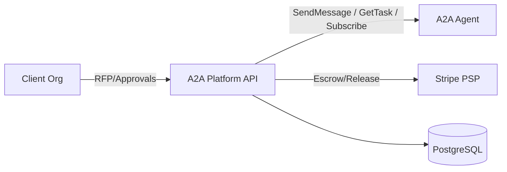
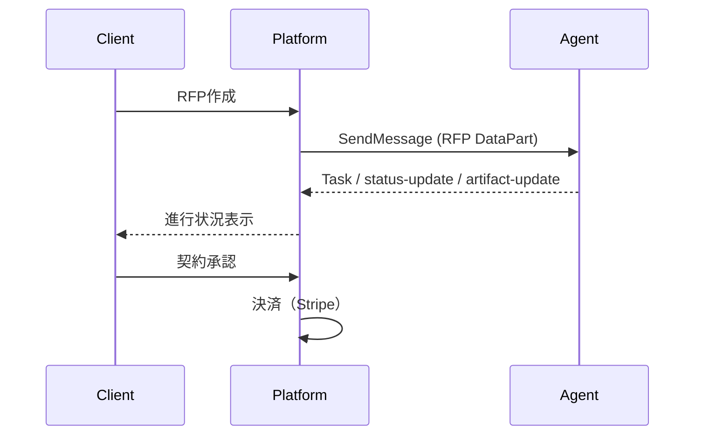

# A2A Platform Backend (MVP)

TypeScript + Fastify + Prisma (PostgreSQL) のAPIサーバです。

## 目的
企業間のエージェント交渉・契約・決済を **A2Aプロトコル**で接続するためのMVP基盤。
RFP配信 → 交渉（Task）→ 契約承認 → エスクロー決済までを最小構成で実装します。

## アーキテクチャ（MVP）


## 主要機能（MVP）
| 領域 | 概要 |
| --- | --- |
| エージェント登録 | AgentCardの登録・検索 |
| RFP配信 | SendMessageで複数Agentへ配信 |
| 交渉追跡 | GetTask/Subscribeで交渉状況を取得 |
| 契約承認 | 両者承認で契約を有効化 |
| 決済 | Stripeエスクロー → リリース |

## ドキュメント
- `doc/` に設計/仕様/アーキテクチャ資料を配置

## セットアップ
```bash
cp .env.example .env
npm install
npm run prisma:generate
npm run prisma:migrate
npm run dev
```

## Stripe設定（必須）
`.env` に以下を設定してください。
- `STRIPE_SECRET_KEY`
- `STRIPE_WEBHOOK_SECRET`
- `STRIPE_RETURN_URL`
- `STRIPE_REFRESH_URL`

## 認証（JWT）
`.env` に以下を設定してください。
- `JWT_SECRET`
- `JWT_ACCESS_TTL`（例: 15m）
- `JWT_REFRESH_DAYS`（例: 30）
- `AUTH_DISABLED`（trueで認証無効）

### 認証エンドポイント
- `POST /auth/register`
- `POST /auth/login`
- `POST /auth/refresh`
- `POST /auth/logout`
- `GET /auth/me`

## エンドポイント（主要）
- `POST /agents`
- `GET /agents`
- `GET /agents/:id`
- `POST /agents/:id/payment-accounts`
- `GET /payment-accounts/:id`
- `POST /payment-accounts/:id/link`

- `POST /rfps`
- `POST /rfps/:id/approve`
- `POST /rfps/:id/dispatch`
- `GET /rfps/:id`
- `GET /rfps/:id/offers`

- `POST /offers`
- `POST /contracts`
- `POST /contracts/:id/approve`
- `GET /contracts/:id`

- `GET /negotiations/:id`
- `GET /negotiations/:id/task`
- `GET /negotiations/:id/subscribe`

- `POST /payments/escrow`
- `POST /payments/:id/release`
- `GET /payments/:id`
- `POST /webhooks/:provider`

- `POST /approvals`
- `GET /disputes`
- `GET /disputes/:id`
- `POST /disputes/:id/decision`

- `GET /orgs/:id/notification-settings`
- `PUT /orgs/:id/notification-settings`
- `GET /users/:id/notification-settings`
- `PUT /users/:id/notification-settings`

## ローカル動作確認（A2A）
`demo-agent/` に検証用のA2Aエージェントを配置しています。

```bash
cd demo-agent
npm install
npm run dev
```

プラットフォーム側のRFP→dispatch→GetTask検証は以下を利用します。
```bash
/usr/bin/python3 scripts/demo_flow.py
```

## 交渉フロー（概要）


## 注意
- A2A SDKは導入済みです（SendMessage/GetTask/Subscribe）
- PSP/Stripe連携はMVP実装です（返金/分割などは未対応）
- 認証はJWT/Refreshを実装済みです
